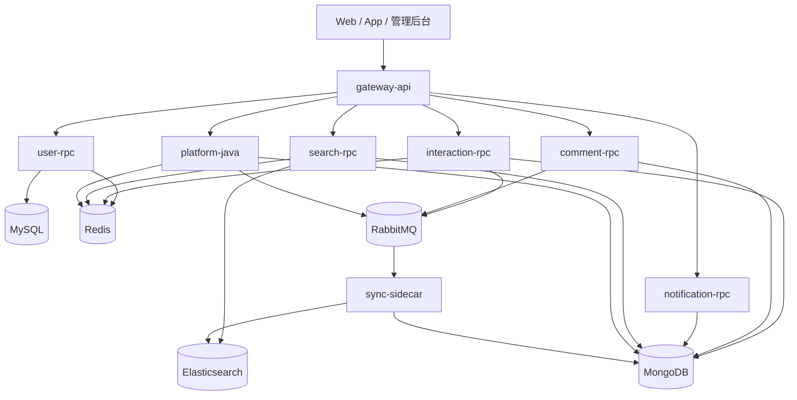

# Sharely / 分享派后端

面向内容社区场景的混合微服务后端项目。项目围绕用户体系、内容发布、互动读模型、搜索索引同步和本地可观测性建设展开，采用 `Go + Java` 双技术栈协同实现。

该仓库不是“为了拆而拆”的微服务练习，而是一个典型的渐进式演进方案：

- 保留 Java 服务承接帖子主写链路、管理后台和部分复杂业务编排
- 将高频读、高并发互动、搜索、评论、通知等模块逐步迁移到 Go 服务
- 通过 RabbitMQ、Redis、Elasticsearch 和观测组件把分布式链路真正跑通

## 项目定位

这个项目更接近一个“工程化学习型作品”而不是单一 CRUD Demo，重点展示的是以下能力：

- 如何在已有 Java 业务核心之上，逐步引入 Go 服务并完成架构拆分
- 如何用 Redis 和 ES 为高频读场景构建独立读模型
- 如何用 RabbitMQ 做异步解耦，接受最终一致性而不是强推分布式事务
- 如何把日志、链路追踪、统一响应结构和本地联调工具补完整

## 技术栈

### 后端服务

- `Go`
  - `go-zero`：网关、zRPC、服务治理基础设施
  - `gRPC / Protobuf`：Go 服务间通信
  - `OpenTelemetry`：链路追踪埋点
- `Java`
  - `Spring Boot`
  - `MyBatis-Plus`
  - `Spring Data MongoDB`
  - `RabbitMQ Client / HTTP 业务适配`

### 数据与中间件

- `MySQL`：账号、认证、强事务用户数据
- `MongoDB`：帖子、评论、通知、交互明细等文档数据
- `Redis`：JWT 失效控制、验证码、互动读模型、缓存
- `Elasticsearch`：帖子搜索、建议词、热度排序
- `RabbitMQ`：事件总线、异步解耦、最终一致性
- `etcd`：Go 服务注册与发现

### 本地观测与开发配套

- `Jaeger`：分布式链路追踪
- `Loki + Promtail + Grafana`：日志采集与检索
- `Prometheus`：指标采集
- `Docker Compose`：本地环境编排

## 系统架构

项目整体采用“网关层 + 领域服务层 + 异步同步层 + 多存储层”的分层结构。



### 分层说明

#### 1. 网关层

`gateway-api` 是统一 HTTP 入口，职责不是简单转发，而是承担：

- JWT 解析与登录态注入
- Cookie / Authorization 双模式鉴权适配
- Go RPC 调用与 Java HTTP 代理的统一出口
- 页面级数据聚合与统一响应结构收敛

它本质上是一个偏 BFF 的聚合网关，而不是纯反向代理。

#### 2. 领域服务层

领域服务按“高频读、高并发、可独立演进”的原则拆分：

- `user-rpc`：账号、登录、资料、Token 生命周期
- `interaction-rpc`：点赞、收藏、评分等高频互动
- `search-rpc`：帖子搜索、建议词、搜索历史
- `comment-rpc`：评论创建、删除、一级评论列表、子评论列表
- `notification-rpc`：通知中心、未读数、批量已读

#### 3. Java 业务核心

`platform-java` 仍承担以下职责：

- 帖子主写链路
- 管理后台
- 关注流、部分复杂聚合接口
- 一部分历史业务逻辑和异步事件消费

这是一个典型的渐进式演进策略：先把最容易形成性能瓶颈、也最适合 Go 的模块迁出来，而不是一次性重写整套系统。

#### 4. 异步同步层

`sync-sidecar` 负责消费 MQ 事件并维护 ES 索引、日志落库等旁路能力。它的存在解决了两个问题：

- 把“主业务写入”和“搜索索引更新”彻底解耦
- 让 Java 和 Go 都不需要在核心请求链路里直接承担 ES 写入成本

## 核心架构设计亮点

### 1. 渐进式混合微服务架构

项目没有采用”推倒重来”的做法，而是在一个已经运行的 Java 业务系统上做增量演进：Java 核心继续承压，Go 服务只在最值得拆分的地方介入。

具体策略：

- **保留高耦合主业务**：帖子发布、管理后台、关注流等功能边界不清晰、业务逻辑重的模块留在 Java，不强行迁移
- **只迁高频、边界清晰的模块**：评论、通知、搜索、互动状态判断——这些模块接口稳定、职责单一、又对性能敏感，是最适合 Go 承担的领域
- **用统一网关屏蔽双栈细节**：`gateway-api` 通过 `javaproxy` 组件，把未迁移接口无缝透传回 Java，前端调用感知不到后端正在演进中

这种做法的价值不是”服务很多”，而是展示了如何在真实约束下做工程权衡——它比全量重写更接近真实的技术决策场景。

### 2. JWT + Redis tokenVersion 双层令牌失效控制

标准 JWT 的问题是无法在过期前主动吊销。本项目采用了一套轻量的双层控制方案：

**令牌结构**：
- `AccessToken`（短有效期）：每次请求验证，内嵌 `tokenVersion` 字段
- `RefreshToken`（长有效期）：使用 `jti`（JWT ID）做一次性 key 存 Redis，刷新后旧 key 立即删除

**失效控制逻辑**：
- 登出时：将两个 token 加入 Redis 黑名单，同时将该用户的 `tokenVersion` 自增
- 网关鉴权时：解析 JWT 后，将 payload 中的 `tokenVersion` 与 Redis 中当前版本对比，不一致则拒绝
- 强制下线 / 密码修改：只需在 Redis 中将该用户 `tokenVersion` 自增，所有旧 token 即时失效，无需遍历

这个方案在”无状态 JWT”和”可主动吊销”之间取了一个合理平衡，不需要为每个请求做全量 Redis 查询，也不依赖 session 机制。

### 3. 网关 javaproxy：混合后端的平滑代理层

`gateway-api` 内部有两类出口：Go RPC 调用和 Java HTTP 代理。`javaproxy` 是后者的核心实现，负责把请求透传到 Java 服务的同时，处理所有上下文传递问题。

它具体做了：

- **用户身份头注入**：将网关解析出的 `userId / role / nickname` 写入 `X-User-Id / X-User-Role / X-User-Nickname`，Java 服务直接读取，不需要自己再做鉴权
- **追踪 ID 保证连续**：如果请求中已有 `X-Request-Id / X-Trace-Id`，原样透传；如果缺失，代理层自动生成并同步写入 `X-Request-Id` 和 `X-Trace-Id`，保证 HTTP → Java 这段链路也有 traceId
- **错误统一包装**：上游超时或不可达时，网关返回 `502` 并输出统一的 JSON 错误结构，而不是把 TCP 错误直接暴露给前端

这使得 Java 接口从外部看和 Go 接口完全一致，前端无需区分。

### 4. 高频互动 Redis 读模型

互动场景的真正挑战不是”怎么写”，而是”怎么高频读”。一个典型的内容列表页，每条帖子都需要知道当前用户是否点赞/收藏，如果每次都回查 MongoDB，延迟和压力都会显著放大。

本项目的处理方式：

- **写入时同步 Redis**：点赞、取消点赞时，`interaction-rpc` 在完成 Mongo 持久化的同时，立刻更新 Redis 中的 Set 结构（`like:post:{postId}` 存储点赞用户 ID）
- **读取时优先走 Redis**：网关在聚合帖子列表时，直接查 Redis 判断当前用户的互动状态，不需要每次回 Mongo
- **异步保持最终一致**：互动明细通过 MQ 事件异步落库，不阻塞请求主链路

这种设计在互动高频场景下，把”N 次 Mongo 查询”变成了”1 次 Redis pipeline”，延迟和并发上限都有明显改善。

### 5. 评论链路的一致性保障

评论模块拆出来之后，需要处理几类原本在单体里被”偷偷藏起来”的一致性问题：

**创建评论时的 MQ 回滚**：
评论写入 Mongo 成功后，会触发 MQ 发布（帖子计数更新、通知触发等副作用依赖这个事件）。如果 MQ 发布失败，评论数据本身需要回滚删除，否则会出现”帖子计数没增加，但评论已存在”的孤岛数据。实现上，MQ 发布失败后同步执行 Mongo 删除，并将错误上抛给调用方，保证调用方感知到失败。

**子评论 `replyCount` 的防重扣减**：
删除子评论时，如果根评论的 `replyCount` 已经为 0，不能再继续扣减（数据库层用 `$gt: 0` 的条件更新），避免计数变成负数。

**软删 vs 硬删的分支设计**：
- 一级评论（根评论）执行**软删除**：内容替换为占位文案”该评论已删除”，但 Mongo 文档保留，这样子评论列表不会因为根评论消失而出现结构断裂
- 二级评论（子评论）执行**硬删除**：直接 `DeleteOne`，没有继续保留的价值
- 软删后不发 MQ delete 事件，避免帖子 `commentCount` 被重复扣减

这些设计细节在测试层都有对应的 L1/L2 用例覆盖（见 `docs/todo-list.md`）。

### 6. 状态型通知的 Upsert 去重

通知中心存在一类”状态型通知”——比如”A 给你点赞了”，如果 A 重复点赞同一篇帖子，不应该生成多条通知，而是更新那一条让它显示为最新发生时间，同时将 `isRead` 重置为 `false`（表示”又发生了一次”）。

实现方式：

```
filter = { receiverId, senderId, type, targetId }   // 四元组唯一键
$set   = { senderNickname, isRead: false, createdAt: now() }
$setOnInsert = { receiverId, senderId, type, targetId }
options.upsert = true
```

通过 `UpdateOne + SetUpsert(true)` 的方式，存在则更新，不存在则插入，整个操作是原子的。MongoDB 层有对应的部分唯一索引 `uk_notifications_state_key` 防止并发写入导致重复。

与此对应，评论和回复类通知是**非状态型**，走 `CreateNotification`（InsertOne），每次触发都应该生成独立通知，不走 upsert 路径。

### 7. 搜索建议词的”原词优先但不盲目插入”策略

建议词接口有一个细节问题：如果用户输入”猫咖”，而 ES 命中的文档里没有任何包含”猫咖”这个词的高亮片段，那要不要把”猫咖”原词放到建议列表第一位？

直接插入的问题是：建议词会显示”猫咖”，但点进去搜索结果可能为零，体验上像”假联想”。

本项目的策略（`assembleSuggestions` 函数）：

1. **只有 ES 有真实命中时，才把原词插入到首位**
2. 如果最终列表里只剩下原词本身（没有任何候选词），则清空列表，返回空数组
3. 对所有候选词去重保序，高亮词优先于普通标题词，最多返回 10 条

这个函数被抽取为纯函数，有独立的表驱动单元测试覆盖所有边界情况。

### 8. sync-sidecar 的 handleUpdate 分支路由

ES 增量同步的核心是 `handleUpdate`，它不是简单地把事件内容写进 ES，而是先回查 Mongo 做一次真实状态判断：

- 如果 Mongo 里的帖子已不存在（`ErrNoDocuments`）→ ES 里也应该删除这条文档
- 如果帖子状态不对（`IsDeleted == 1` 或 `Status != 1`）→ 同样走删除分支
- 只有状态完全正常的文档才会写入 ES

这个设计解决了一个真实的最终一致性问题：如果帖子在 MQ 事件投递期间被删除，事件消费端不能盲目写入 ES，而应该以 Mongo 的当前状态为准。Mongo 是唯一数据源，ES 是派生的读模型。

### 9. 可观测性：三类链路统一串联

本地环境实现了 HTTP、gRPC、MQ 三类链路的统一观测：

**日志字段规范**：所有服务日志统一输出 `service / traceId / requestId / routingKey` 四个字段。HTTP 请求的 `requestId` 在网关层生成并注入 context，透传到 Go RPC 调用和 Java HTTP 代理；MQ 消费链路通过消息 header 中的 `X-Trace-Id` 传递 traceId。

**三套工具配合**：
- **Jaeger**（`:16686`）：跨服务 span 可视化，能看到一次请求在网关、RPC 服务、Mongo 之间的完整耗时分布
- **Loki + Grafana**（`:3001`）：结构化日志检索，可以用 `{service=”comment-rpc”} |= “traceId=xxx”` 把一条请求在评论服务的所有日志拉出来
- **Prometheus**：各服务暴露 `/metrics`，采集 RPC 请求延迟、错误率等业务指标

这使得调试跨服务 bug（如”评论创建成功但通知没触发”）不再需要在多个容器日志里肉眼比对，而是通过 traceId 在 Grafana 里一次性定位。

## 模块划分

### gateway-api

职责：

- 统一 HTTP 入口
- 鉴权与用户上下文注入
- Go RPC 调用
- Java 接口代理（支持通过 `javaproxy` 平滑透传未迁移的管理后台 `/admin/*` 和复杂用户个人域接口）
- 聚合多服务结果并输出前端友好结构

适合展示的点：

- BFF 思维与混合后端统一出口
- 基于反向代理实现平滑迁移（`javaproxy` 处理上下文透传和错误包装）
- 统一错误码与响应结构

### user-rpc

职责：

- 注册、登录、登出、刷新 Token
- 邮箱验证码
- 用户资料查询与更新
- 用户事件发布

适合展示的点：

- `AccessToken + RefreshToken` 双令牌方案
- Redis 中的 `tokenVersion / jti` 控制即时失效
- 用户资料更新后的事件传播

### interaction-rpc

职责：

- 点赞、取消点赞
- 收藏、取消收藏
- 评分
- 用户态互动状态读取

适合展示的点：

- Redis 读模型
- 高频互动状态快速判定
- 与 Mongo / MQ 的最终一致性配合

### search-rpc

职责：

- 帖子搜索
- 搜索建议
- 搜索历史管理

适合展示的点：

- ES 搜索链路
- 建议词策略
- 热度排序与时间衰减

### comment-rpc

职责：

- 创建评论
- 删除评论
- 一级评论列表
- 子评论分页

适合展示的点：

- 评论树查询建模
- MQ 事件驱动副作用
- 创建失败时的回滚与删除计数一致性修复

### notification-rpc

职责：

- 未读数
- 通知列表
- 全部已读 / 批量已读
- 状态型通知写入与去重

适合展示的点：

- 状态型通知唯一索引
- 批量已读接口拆分
- 通知中心从 Java 中抽离

### sync-sidecar

职责：

- 消费 MQ 事件
- Mongo -> ES 全量 / 增量同步
- 日志旁路处理

适合展示的点：

- Sidecar 模式
- 搜索索引异步同步
- 管理接口触发全量重建

### platform-java

职责：

- 帖子主写
- 管理后台
- 部分历史业务与异步消费逻辑

适合展示的点：

- 作为演进前核心业务服务继续承压
- 与 Go 服务共同构成双栈系统
- 渐进式迁移中的边界保留策略

## 为什么这样设计

### 为什么用 Go + Java 混合，而不是统一技术栈

- Java 侧已有较完整业务实现，直接重写成本太高
- Go 更适合承担边界清晰、性能敏感的服务
- 双栈结合能体现真实工程中的“迁移与演进”，而不是理想化从零搭建

### 为什么不做分布式事务

项目选择 MQ 驱动的最终一致性，而不是在多个服务和多个存储之间强行维持分布式事务。

原因很直接：

- 搜索索引和通知写入不值得进入主事务
- 分布式事务侵入性强，性能成本高
- 内容社区场景通常允许短时间不一致，只要有补偿和重试机制

### 为什么 Redis 要同时用于鉴权和互动

因为这两个场景都需要“高频、低延迟、可过期”的数据访问：

- 鉴权需要快速校验 Token 是否仍有效
- 互动状态需要快速判断用户是否点赞 / 收藏

Redis 在这里承担的是“会话控制 + 读模型加速”两种角色。

## 典型业务链路

### 发帖 -> 搜索可见

1. 用户通过网关调用 Java 发帖接口
2. Java 写入 MongoDB
3. Java 发布帖子事件到 RabbitMQ
4. `sync-sidecar` 消费事件并同步 ES
5. `search-rpc` 从 ES 返回搜索结果

### 评论 -> 计数/通知同步

1. 网关调用 `comment-rpc` 创建评论
2. `comment-rpc` 写入 Mongo，并发布 `comment.create`
3. Java 或其他消费者处理帖子计数、通知落库等副作用
4. 若事件发布失败，评论服务回滚写入，避免数据孤岛

### 搜索结果页聚合

1. 前端请求 `gateway-api`
2. 网关调用 `search-rpc` 获取 ES 搜索结果
3. 网关按需要补充用户态互动信息和作者资料
4. 返回统一的 `PostVO / PageResult` 给前端

## 本地启动

### 1. 启动基础设施与 Go 服务

```bash
docker compose up -d --build
```

### 2. 宿主机启动 Java 服务

```bash
cd services/platform-java
./scripts/run-platform-java-with-otel.sh
```

### 3. 常用入口

- API 网关：`http://localhost:8090`
- Jaeger：`http://localhost:16686`
- Grafana：`http://localhost:3001`
- RabbitMQ 管理台：`http://localhost:15672`

## 仓库结构

```text
.
├── services/
│   ├── gateway-api/
│   ├── user-rpc/
│   ├── interaction-rpc/
│   ├── search-rpc/
│   ├── comment-rpc/
│   ├── notification-rpc/
│   ├── sync-sidecar/
│   └── platform-java/
├── proto/
├── docs/
├── scripts/
└── docker-compose.yml
```

## 关键词

- `Go / Java 混合微服务`
- `go-zero / Spring Boot`
- `Redis 读模型`
- `RabbitMQ 事件驱动`
- `MongoDB + Elasticsearch`
- `最终一致性`
- `OpenTelemetry / Jaeger / Loki / Grafana`

