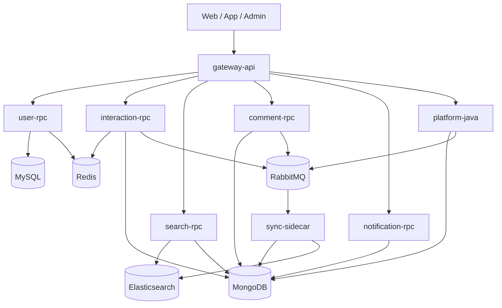

# Sharely / 分享派后端

Sharely 是一个内容社区后端，支持用户认证、内容发布、搜索、互动、评论、关注、通知和后台审核。项目采用 **Go + Java 渐进式混合微服务架构**：统一网关负责协议适配与服务聚合，Go RPC 承载已拆分领域，Java 服务保留帖子主写、后台管理等业务。配套前端只依赖网关契约，不感知内部服务划分。

> `Sharely` 是项目对外名称；代码中的 `rednote`、`platform` 等历史命名暂用于兼容现有模块、数据库和制品。

## 架构


```mermaid
flowchart TD
    Client[Web / App / Admin] --> Gateway[gateway-api]
    Gateway --> User[user-rpc]
    Gateway --> Interaction[interaction-rpc]
    Gateway --> Search[search-rpc]
    Gateway --> Comment[comment-rpc]
    Gateway --> Notification[notification-rpc]
    Gateway --> Java[platform-java]

    User --> MySQL[(MySQL)]
    User --> Redis[(Redis)]
    Interaction --> Redis
    Interaction --> Mongo[(MongoDB)]
    Interaction --> MQ[(RabbitMQ)]
    Search --> ES[(Elasticsearch)]
    Search --> Mongo
    Comment --> Mongo
    Comment --> MQ
    Notification --> Mongo
    Java --> Mongo
    Java --> MQ
    MQ --> Sidecar[sync-sidecar]
    Sidecar --> Mongo
    Sidecar --> ES
```

### 服务职责

| 服务 | 职责 |
|---|---|
| `gateway-api` | HTTP 入口、JWT 鉴权、BFF 聚合、Go RPC 调用、Java 反向代理 |
| `user-rpc` | 注册登录、双 Token、邮箱验证码、用户资料 |
| `interaction-rpc` | 点赞、收藏、评分及 Redis 高频读模型 |
| `search-rpc` | ES 搜索、建议词、搜索历史 |
| `comment-rpc` | 评论创建、查询、软删/硬删 |
| `notification-rpc` | 通知列表、未读数、批量已读、状态型通知去重 |
| `sync-sidecar` | MQ 消费、MongoDB → Elasticsearch 同步与全量重建 |
| `platform-java` | 帖子主写、关注关系、后台管理及历史复杂业务 |

### 数据职责

| 组件 | 用途 |
|---|---|
| MySQL | 账号、认证和 Token 版本等事务数据 |
| MongoDB | 帖子、评论、通知、关注和互动明细 |
| Redis | Token 状态、验证码、互动读模型和缓存 |
| Elasticsearch | 全文搜索、建议词和排序 |
| RabbitMQ | 领域事件、异步副作用和最终一致性 |
| etcd | Go RPC 服务注册与发现 |

## 设计要点

- **渐进式迁移**：网关同时调用 Go RPC 和 Java HTTP，避免一次性重写已有业务。
- **BFF 聚合**：网关聚合搜索结果、作者资料和互动状态，前端不需要拼装多个服务。
- **互动读模型**：Redis 使用 Set/Hash 保存点赞、收藏和评分状态；缓存缺失时从 MongoDB 预热，并使用短锁、空值占位和 Bloom Filter 降低穿透与击穿风险。
- **业务化一致性**：评论关键事件发布失败时回滚写入；点赞等弱一致操作允许短暂偏差，通过异步链路收敛。
- **可重建搜索索引**：MongoDB 是内容事实源，ES 是派生读模型；sidecar 以 MongoDB 当前状态决定更新或删除索引。
- **链路观测**：通过 OpenTelemetry 在 HTTP、gRPC、MQ 间传播 trace 上下文，并接入 Jaeger、Prometheus、Loki 和 Grafana。

更多架构取舍见 [项目技术总结](docs/resume_project_summary.md)。

## 本地开发

### 环境要求

- Go 1.25+
- JDK 17、Maven 3.9+
- Docker Compose
- 建议至少 16GB 内存、30GB Docker 可用空间

Apple Silicon 可以原生运行当前关键镜像。推荐 Java 运行在宿主机，基础设施和 Go 服务运行在 Docker 中。

### 1. 准备配置

```bash
cp services/user-rpc/.env.example services/user-rpc/.env
cp services/platform-java/.env.example services/platform-java/.env
```

按需填写邮件、JWT 和第三方服务配置，变量说明见 [platform-java README](services/platform-java/README.md)。真实 `.env` 和密钥不应提交到仓库。

### 2. 分阶段启动

所有 Docker Compose 命令均在仓库根目录执行。

```bash
# 核心基础设施
docker compose up -d etcd db mongo redis mq

# 搜索与追踪
docker compose up -d --build es jaeger

# Go RPC 和网关
docker compose up -d --build \
  user-rpc interaction-rpc search-rpc \
  notification-rpc comment-rpc gateway-api

# 异步同步
docker compose up -d --build sync-sidecar
```

在宿主机启动 Java：

```bash
cd services/platform-java
mvn spring-boot:run
```

需要完整观测栈时再启动：

```bash
docker compose up -d prometheus loki promtail grafana
```

### 3. 常用入口

| 服务 | 地址 |
|---|---|
| API 网关 | <http://localhost:8090> |
| Java 服务 | <http://localhost:8080> |
| RabbitMQ 管理台 | <http://localhost:15672> |
| Elasticsearch | <http://localhost:9200> |
| Jaeger | <http://localhost:16686> |
| Prometheus | <http://localhost:9091> |
| Grafana | <http://localhost:3001> |

查看状态和日志：

```bash
docker compose ps
docker compose logs -f gateway-api
```

## 测试

### Go

每个 Go 服务是独立模块，CI 会分别执行测试和静态检查：

```bash
cd services/comment-rpc
go test ./...
go vet ./...
```

### Java

```bash
cd services/platform-java

# 默认：无外部副作用的快速测试
mvn test

# 集成：需要独立测试数据库和本地中间件
mvn test -Pintegration

# 真实邮件/OSS：仅使用专用测试账号显式执行
RUN_EXTERNAL_TESTS=true \
EXTERNAL_TEST_EMAIL=your-test-mailbox@example.com \
mvn test -Pexternal
```

### 跨服务 Smoke

```bash
./scripts/smoke/run_all.sh
```

Smoke 测试依赖完整集群，不在普通 PR CI 中执行。

## 当前状态

- 已完成用户、互动、搜索、评论、通知领域的 Go RPC 拆分。
- 已实现网关鉴权、接口聚合、Java 代理及跨语言 RabbitMQ 事件链路。
- 已接入 HTTP、gRPC、MQ 链路追踪，以及 Prometheus、Loki、Grafana 可观测栈。
- 已建立 Go/Java 分层测试、跨服务 Smoke 和 CI 校验。
- macOS + OrbStack 完整环境下 5 条跨服务 Smoke 全部通过。

待办与已知限制见 [TODO](docs/todo-list.md)。

## 文档

- [文档导航](docs/README.md)
- [项目技术总结](docs/resume_project_summary.md)
- [可观测性](docs/observability.md)
- [Grafana 面板](docs/grafana.md)
- [用户事件契约](docs/user_events.md)
- [业务错误码](docs/business_codes.md)
- [开发 TODO](docs/todo-list.md)

## 仓库结构

```text
.
├── services/       # 网关、Go RPC、Java 服务、sidecar
├── proto/          # gRPC / Protobuf 契约
├── deploy/         # ES、Prometheus、Grafana、Loki、Nginx 配置
├── scripts/        # 初始化、审计、联调和 smoke 脚本
├── docs/           # 架构、运维、测试和协议文档
└── docker-compose.yml
```
